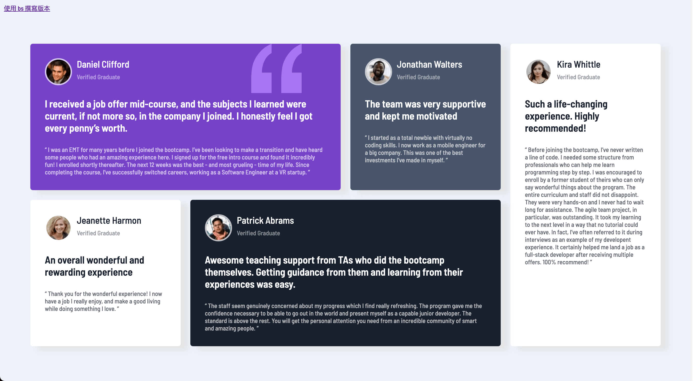

# Testimonials - Responsive Web Design Project

## 目錄

- [總覽](#總覽)
  - [專案介紹](#專案介紹)
  - [線上預覽](#線上預覽)
  - [成品預覽](#成品預覽)
- [開發過程](#開發過程)
  - [使用技術](#使用技術)
  - [我學到的內容](#我學到的內容)
  - [持續精進](#持續精進)
  - [實用資源](#實用資源)

## 總覽

### 專案介紹

這個專案採用了響應式網頁設計（RWD），支援電腦版和移動設備版。請調整瀏覽器的螢幕寬度來檢視不同的版型：

- 電腦版（> 768 px）
- 移動設備版（< 768 px，包括手機和平板）

我在開發這個專案時，練習使用純 SCSS 及 SCSS + BS 兩種不同方式撰寫，預覽圖為純 SCSS 撰寫版本，可以透過左上角連結切換檢視兩個不同版本

#### [線上預覽](https://jess99978.github.io/testimonials-grid-section-main/)

### 成品預覽

#### 電腦版預覽圖

#### 移動設備預覽圖

## 開發過程

### 使用技術

- BEM：使用 BEM（Block,Element,Modifier）命名規範來設計 HTML 的 class
- SCSS： 使用 SCSS 的模組化（import、use）、變數、巢狀結構
- 響應式網頁設計（RWD）：採用響應式網頁設計，使網頁能夠適應不同設備和螢幕尺寸，包括電腦和移動設備
- Flexbox、Grid：使用 Flexbox 和 CSS Grid 進行頁面佈局，實現彈性和網格布局
- Bootstrap：使用 Bootstrap 框架來快速搭建響應式網頁，提供一致的外觀和使用體驗
- Git 版本控制

### 我學到的內容

- 使用 Grid 來佈局頁面，並用 order 來控制不同設備中組件的排列順序
- 使用 BEM 原則來命名 class 及撰寫 SCSS，讓程式碼更簡潔易讀
- Bootstrap 的優勢在於快速構建一致性的 UI，但針對需要高度自定義的專案，會產生許多非預期行為，反而要花費更多的時間在「修改預設變數」上

### 持續精進

- 利用 Tailwind 高度自定義的特性與 SCSS 搭配進行開發
- 練習 CSS animation

### 實用資源

- [Bootstrap 官網](https://getbootstrap.com/) - 針對 Bootstrap 的安裝、組件使用方式與其效果、如何自定義預設樣式，都有完整而詳細的說明。
